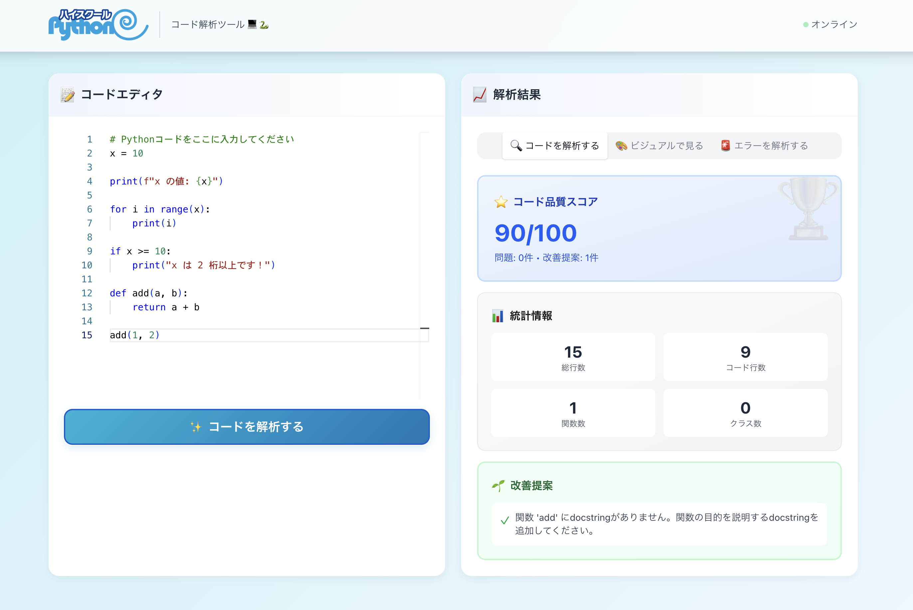
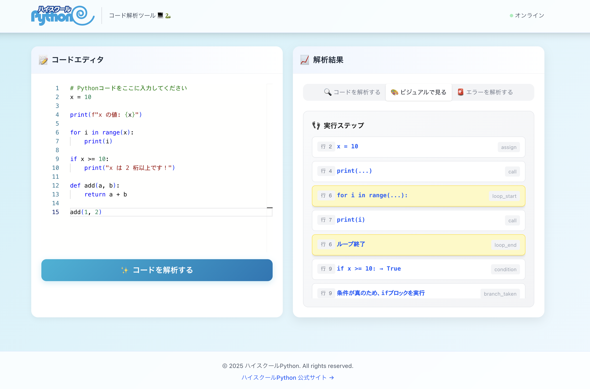

# ハイスクール Python - コード解析ツール

高校生が Python プログラミングを学ぶための統合的な学習支援ツールです。コードの構造解析、実行フローの可視化、エラーの教育的説明を提供し、プログラミング学習をより理解しやすくします。

[GitHub Repository](https://github.com/high-school-python/high-school-python-code-analytics)

## 注意

Claude の利用規約では、18 歳未満の利用は禁止されています 😭

他の生成 AI サービスが MCP サーバーの接続を提供してくれることに期待！！

<https://www.anthropic.com/legal/consumer-terms>

## デモ

URL: <https://code-analytics.high-school-python.jp/>

```py
# Python コードをここに入力してください
x = 10

print(f"x の値: {x}")

for i in range(x):
    print(i)

if x >= 10:
    print("x は 2 桁以上です！")

def add(a, b):
    return a + b

add(1, 2)
```




## アーキテクチャ

```txt
┌─────────────┐     ┌─────────────┐
│   Webアプリ  │     │Claude Desktop│
│  (Next.js)  │     │  + MCP Client│
└──────┬──────┘     └──────┬──────┘
       │                    │
       └────────┬───────────┘
                │ HTTP/REST
                ▼
        ┌───────────────┐
        │  FastAPI      │
        │ 共通バックエンド │
        └───────────────┘
                │
    ┌───────────┴───────────┐
    ▼           ▼           ▼
┌─────────┐ ┌─────────┐ ┌─────────┐
│AST 解析  │ │可視化    │ │エラー解析│
│エンジン   │ │SVG 生成 │ │教育的説明│
└─────────┘ └─────────┘ └─────────┘
```

## 主な機能

### 1. コード構造解析

- AST を使用した静的コード解析
- 関数、クラス、変数、ループ、条件分岐の抽出
- コード複雑度の計算
- スタイルチェックと改善提案

### 2. 実行フローの可視化

- ステップバイステップの実行追跡（静的解析）
- 変数の状態変化の追跡
- SVG 形式のフローチャート生成
- コードの動作説明

### 3. エラーの教育的説明

- エラーメッセージの分かりやすい解説
- 高校生向けのシンプルな説明と詳細説明
- 一般的な原因と修正方法の提案
- 類似例とデバッグのヒント
- 学習リソースへのリンク

## 特徴

- **安全性第一**: コード実行なし、AST による静的解析のみ
- **教育的アプローチ**: 高校生に適した言葉遣いと段階的な説明
- **多様なアクセス方法**: Web、API、Claude Desktop (MCP) で利用可能
- **視覚的理解**: フローチャートと図表で理解を促進

## セットアップ

### 1. 依存関係のインストール

```bash
# APIサーバー
cd api
uv sync

# MCPクライアント
cd ../mcp
uv sync

# Webアプリ
cd ../web
npm install
```

### 2. FastAPI サーバーの起動

```bash
cd api
uv run fastapi dev src/main.py
```

API ドキュメント: <http://localhost:8000/docs>

### 3. Web アプリの起動

```bash
cd web
npm run dev
```

Web アプリ: <http://localhost:3000>

### 4. MCP サーバーの設定（Claude Desktop 用）

`~/.claude/claude_desktop_config.json` に以下を追加:

```json
{
  "mcpServers": {
    "high-school-python": {
      "command": "uv",
      "args": ["--directory", "/path/to/high-school-python-code-analytics/mcp", "run", "python", "src/server.py"],
      "env": {
        "API_BASE_URL": "http://localhost:8000"
      }
    }
  }
}
```

注意: `/path/to/high-school-python-code-analytics/mcp` を実際のプロジェクトのパスに置き換えてください。

## API エンドポイント

### コード解析

```http
POST /api/v1/analyze
Content-Type: application/json

{
  "code": "def hello():\n    print('Hello, World!')"
}
```

### 実行フロー可視化

```http
POST /api/v1/visualize
Content-Type: application/json

{
  "code": "for i in range(5):\n    print(i)"
}
```

### エラー解析

```http
POST /api/v1/analyze-error
Content-Type: application/json

{
  "error_message": "NameError: name 'x' is not defined",
  "code": "print(x)"  // オプション
}
```

## 開発

### テストの実行

```bash
# API
cd api
uv run pytest

# MCP
cd mcp
uv run pytest

# Web
cd web
npm run build
```

### Vercel へのデプロイ

Web アプリは Vercel にデプロイできます：

1. Vercel にサインアップ
2. GitHub リポジトリを接続
3. ルートディレクトリを `web` に設定
4. 環境変数 `NEXT_PUBLIC_API_URL` を API サーバーの URL に設定
5. ビルドコマンド: `npm run build`
6. 出力ディレクトリ: `.next`

### コード品質

```bash
# Python コードのリントとフォーマット
cd api
uv run ruff check .
uv run ruff format .

# TypeScript/JavaScript のリント
cd ../web
npm run lint
```

## ライセンス

MIT License
